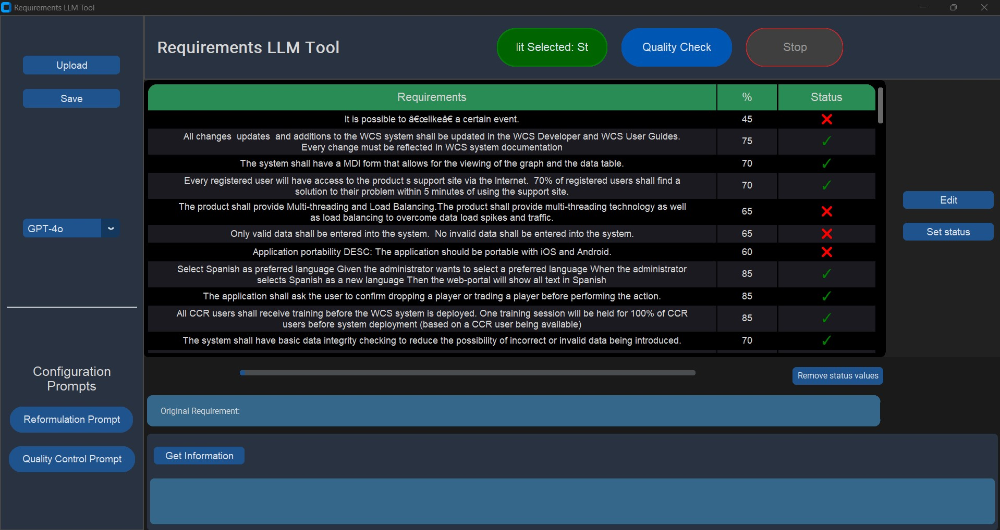

# LLM Based Requirements Tool

## Project Description

**LLM Based Requirements Tool** is a Python application designed to analyze and enhance requirements from ReqIF files. Utilizing Large Language Models (LLMs), this tool rephrases requirements into natural language and evaluates their quality based on predefined criteria. Built with Custom Tkinter for a user-friendly interface, the tool aims to improve the clarity and consistency of requirements documentation in the field of Requirements Engineering.

Here is a screenshot of the tool in action:



### Features

- **Natural Language Rephrasing:** Converts requirements into clear, understandable natural language.
- **Quality Assessment:** Provides a percentage-based evaluation of the clarity and consistency of requirements.

## Installation

Follow these steps to set up the **LLM Based Requirements Tool** on your local machine:

### Prerequisites

- **Python**: Ensure you have Python 3.9 or later installed.
- **pip**: The Python package installer.

### Installation Steps

```sh
git clone https://github.com/fatihkutlu2024/LLM-based-Requirements-Tool.git
cd LLM-based-Requirements-Tool
pip install -r requirements.txt
```


### API Key Configuration

To use the different LLMs supported by the tool, you need to manually configure the API keys in the code. Here are the respective pages where you can obtain your API keys:

- **OpenAI**: [OpenAI API Keys](https://platform.openai.com/account/api-keys)
- **OpenRouter**: [OpenRouter API Keys](https://openrouter.ai/api-keys)
- **DeepInfra**: [DeepInfra API Keys](https://api.deepinfra.com/v1/openai)

Update the API keys in the source code file as follows:

1. Open the source code file where the API keys are configured.
2. Replace the `"API-KEY"` placeholders with your actual API keys.
3. Save the changes and restart the application.